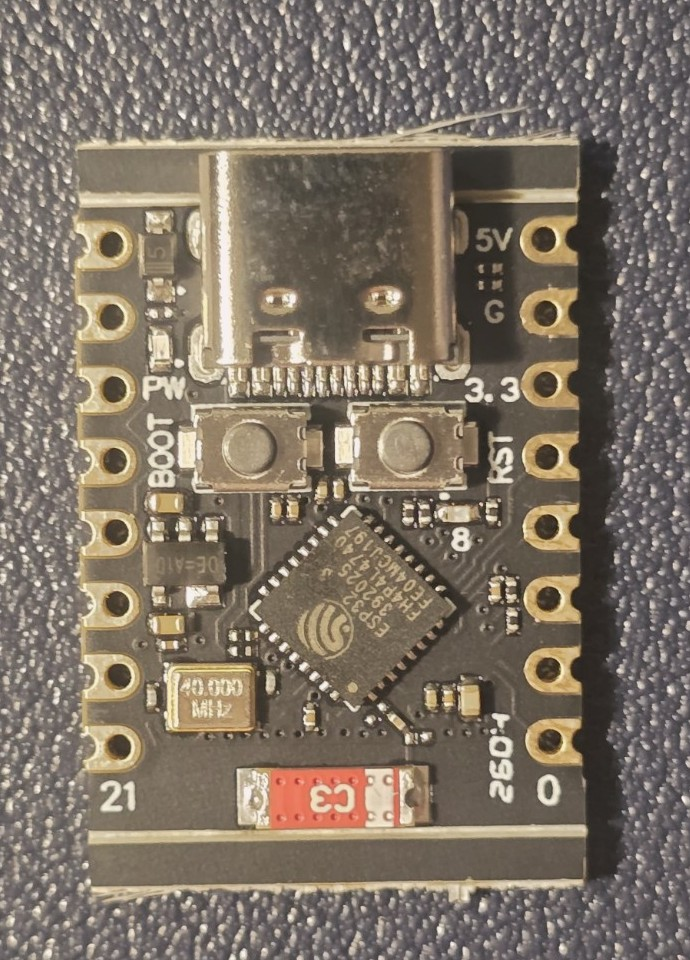
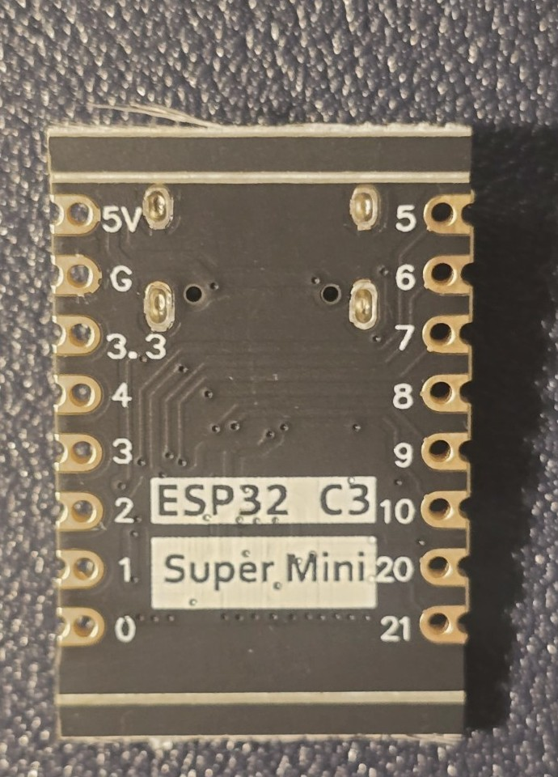

# ADR-0001 — MVP Edge Compute Platform

**Status:** Accepted  
**Date:** 2026-07-14  
**Project:** [ITS] [EDGE] HomeEdge AI Platform  
**Jira:** [IHAP-44](https://niccolopiazzi01.atlassian.net/browse/IHAP-44)  
**PR:** [#23](https://github.com/pianic2/homeedge-ai-platform/pull/23)  
**Supersedes:** None  
**Superseded by:** None

<!--
AI_AGENT_METADATA:
  document_type: architecture_decision_record
  decision_scope: mvp_edge_compute_platform
  issue: IHAP-44
  parent_issue: IHAP-43
  canonical_template: docs/adr/template.md
  status: Accepted
  approval_authority: project_owner
  approval_recorded: true
  source_of_truth: github_versioned_repository_documentation
  jira_role: workflow_state_blockers_and_evidence_links
  confluence_role: optional_stakeholder_summary_and_navigation_only
  accepted_chip_family: esp32_c3
  preferred_board_status: preferred_conditional_implementation
  control_and_fallback: esp32_c3_devkitc_02
  minimum_usable_flash_mb: 2
  preferred_flash_mb: 4
  minimum_safe_application_gpio: 8
  local_display_status: pending_ihap_53
  quantitative_power_validation_issue: IHAP-49
  runtime_changes_allowed: false
  firmware_changes_allowed: false
  unvalidated_claim_marker: "[UNVALIDATED]"

HIDDEN_ANTI_REGRESSION_RULES:
  - Keep one stable decision in this ADR: the MVP edge-compute family and board-conformance strategy.
  - Do not treat every board sold as SuperMini as equivalent to the photographed specimen.
  - Keep the purchased SuperMini-compatible board conditional until its exact PCB and representative behavior are qualified.
  - Keep ESP32-C3-DevKitC-02 as the official control and fallback.
  - Do not introduce a local display into the MVP through this ADR; display scope belongs to IHAP-53.
  - Keep I2C in the board profile only to preserve the environmental-sensor alternatives owned by IHAP-45.
  - Do not infer measured board or node power from chip-level datasheet values.
  - Quantitative rail, regulator, current and autonomy validation belongs to IHAP-49.
  - Preserve [UNVALIDATED] for seller, lot, exact replacement, current replication cost and untested runtime claims.
  - Do not introduce production-ready, commercial-ready, security-grade, certified, safety-critical, alarm-grade, antifurto, access-control, intrusion-detection, reliability or autonomy claims.
-->

---

## 1. Context

HomeEdge MVP uses one generic room/door node. The canonical Product Vision limits that node to:

- temperature telemetry;
- humidity telemetry;
- local non-identifying presence state;
- door open/closed telemetry;
- target HTTP/JSON transport `[UNVALIDATED]`;
- reproducible flashing and diagnostics.

A stable compute decision is required because the board determines the firmware toolchain, radio interface, GPIO budget, voltage boundaries, debugging path, enclosure constraints and replacement strategy.

The commercial label **ESP32-C3 SuperMini** is not an Espressif board standard. Different sellers may use the same name for boards with different pin exposure, regulators, LEDs or PCB revisions. The decision must therefore separate:

1. the MCU family;
2. the minimum board-conformance profile;
3. the exact physical board revision.

### 1.1 Evidence available for the owned specimen

Runtime evidence supplied by the Project Owner establishes, for one specimen:

- ESP32-C3 QFN32 revision v0.4;
- 4 MB XMC embedded flash;
- native USB Serial/JTAG;
- successful flashing, verification, hard reset and boot from PC USB;
- historical prototype use of GPIO0–GPIO6.

Unique device identifiers from the runtime log are intentionally omitted.

The front and rear photographs below were supplied by the Project Owner and sanitized for repository publication by cropping, JPEG conversion and EXIF removal. They document one owned specimen only.



*Figure E-IHAP44-01 — Front view. Visible evidence includes USB-C, BOOT and RST buttons, the ESP32-C3 package, the 40 MHz crystal and the PCB antenna area.*



*Figure E-IHAP44-02 — Rear view. Visible evidence includes the `ESP32 C3 Super Mini` label, supply pins and exposed GPIO labels.*

For the photographed specimen, the images support these observations:

- PCB label `ESP32 C3 Super Mini`;
- USB-C connector;
- dedicated `BOOT` and `RST` buttons;
- supply labels `5V`, `G` and `3.3`;
- GPIO labels `0`–`10`, `20` and `21`;
- chip marking visually consistent with an ESP32-C3 variant with embedded 4 MB flash;
- board-level regulator identity and complete power path remain `[UNVALIDATED]`;
- exact seller, listing and lot correspondence remain `[UNVALIDATED]`.

### 1.2 Functional and GPIO pressure

Until IHAP-45, IHAP-46 and IHAP-47 complete their component decisions, the compute platform must preserve proportionate support for both environmental-sensor paths, full-duplex radar UART and the door input.

| Function | Interface | GPIO impact | Decision owner |
|---|---|---:|---|
| BME280 environmental option | I2C | 2 | IHAP-45 |
| DHT11/DHT22 environmental option | Digital | 1 | IHAP-45 |
| LD2410C telemetry/configuration | Full-duplex UART | 2 | IHAP-46 |
| MC-38 door state | Interrupt-capable digital input | 1 | IHAP-47 |
| Engineering margin | Digital/ADC | 2 | ADR-0001 profile |
| Local display | None, or I2C if later accepted | 0 or 2 | IHAP-53 |

The worst canonical core scenario requires seven safe application GPIO including two margin pins. This ADR requires eight safe application GPIO to retain board-level headroom and replacement tolerance. The eighth pin is not reserved for a display.

The photographed board exposes a conservative candidate set:

`GPIO0, GPIO1, GPIO3, GPIO4, GPIO5, GPIO6, GPIO7, GPIO10`

GPIO2, GPIO8 and GPIO9 are excluded from the baseline because they are ESP32-C3 strapping pins. GPIO20 and GPIO21 should remain available for UART0/recovery when practical. GPIO7, GPIO10 and hidden onboard loads still require representative functional validation before the exact PCB can be promoted from conditional to unconditional reference.

---

## 2. Decision

```text
We will use ESP32-C3 as the MVP edge-compute family.

The purchased ESP32-C3 SuperMini-compatible board is the preferred compact
implementation, conditionally qualified for the photographed PCB revision.

ESP32-C3-DevKitC-02 is the official qualification control and fallback.
```

The Project Owner accepted this decision on 2026-07-14.

An acceptable board must provide:

- integrated 2.4 GHz Wi-Fi;
- officially maintained ESP-IDF C/C++ support;
- at least 2 MB usable flash, with 4 MB preferred;
- 3.3 V GPIO logic;
- repeatable flashing, serial diagnostics, reset and bootloader recovery;
- one I2C bus, preserving the IHAP-45 BME280 option;
- one full-duplex UART;
- one interrupt-capable digital input;
- one spare ADC-capable GPIO;
- at least eight safe application GPIO after USB, boot, debug, strapping and onboard-load constraints;
- functional PC-USB operation without observed brownout or reset loops;
- an identifiable physical PCB revision when promoted as an exact reference board.

This decision does **not**:

- approve every board sold as `ESP32-C3 SuperMini`;
- approve a final pin mapping;
- select the environmental, presence, door, display, power, interconnect or enclosure components;
- authorize Bluetooth as an MVP requirement;
- authorize audio acquisition or audio-derived runtime behavior;
- make a local OLED or other display part of the MVP;
- validate rail voltage, current draw, regulator capacity, thermal behavior or autonomy;
- approve the IHAP-17 BOM as definitive;
- establish production, commercial, reliability, security, safety or certification maturity.

The exact commercial SuperMini seller, listing, lot and replacement reproducibility remain `[UNVALIDATED]`.

---

## 3. Alternatives Considered

| Alternative | Outcome | Reason |
|---|---|---|
| Purchased ESP32-C3 SuperMini-compatible board | Accepted conditionally | Compact, low historical acquisition cost, ESP-IDF-compatible and sufficient static GPIO exposure on the photographed specimen. Seller/lot reproducibility and representative runtime qualification remain incomplete. |
| ESP32-C3-DevKitC-02 | Accepted as control/fallback | Official documentation, controlled pinout and debugging path. It is larger than the preferred compact implementation but provides a reproducible comparison baseline. |
| ESP32 DevKit V1 / ESP-WROOM-32 class | Rejected as primary baseline | Functionally sufficient, but larger and based on a different MCU baseline. Generic clone naming still creates board-level variability. |
| ESP32-S3 development board | Rejected | Provides unnecessary compute and GPIO margin for the current MVP and would increase cost and scope without a demonstrated benefit. |
| Raspberry Pi Pico W | Rejected | Technically viable, but would require a different SDK/toolchain and firmware port with no current MVP advantage. |
| ESP8266 | Rejected | Reduced peripheral margin and a legacy direction compared with ESP32-C3. |
| Linux SBC at each room node | Rejected | Adds operating-system lifecycle, storage, boot, patching, power and maintenance complexity disproportionate to the room/door node. |

A replacement ESP32-C3 board does not require a new platform ADR when it satisfies the accepted conformance profile, has an identifiable revision and does not change the firmware architecture or MVP scope. A different MCU family requires a superseding ADR.

---

## 4. Consequences

### Positive

- Establishes one proportionate MCU family for edge nodes.
- Preserves ESP-IDF and C/C++ as the firmware baseline.
- Keeps the compute decision independent from seller-specific PCB naming.
- Preserves I2C, UART, interrupt input and ADC capacity required by downstream component decisions.
- Provides an official control/fallback for debugging and qualification.
- Avoids Linux-per-room complexity.
- Makes the exact SuperMini PCB replaceable through a conformance profile rather than a seller name.

### Negative / Trade-offs

- The preferred compact board remains conditional rather than a universally reproducible SKU.
- Only one owned PCB revision is currently photographed.
- The eight-GPIO profile has limited surplus after representative peripherals are selected.
- Compact boards increase wiring and enclosure sensitivity.
- Onboard LED and regulator circuits remain partly unidentified.
- Current equivalent-board availability and landed replacement price remain `[UNVALIDATED]`.
- Physical 4 MB flash was observed while historical firmware used a 2 MB configuration; correcting firmware partition configuration is separate work.

### Neutral / Operational

- Bluetooth may exist in silicon but is not required by the MVP.
- A local display remains undecided under IHAP-53.
- Final wiring belongs to IHAP-50 after component decisions and exact pin qualification.
- Quantitative power evidence belongs to IHAP-49.
- Board-level rejection does not reject ESP32-C3; ESP32-C3-DevKitC-02 becomes the implementation fallback.

---

## 5. Related Risks and Treatments

This ADR does not directly modify an existing Risk Record or Risk Treatment.

| Risk | Treatment | Effect | Remaining exposure |
|---|---|---|---|
| None | None | Leaves existing governance and hardware risks unchanged | Exact-board reproducibility, onboard-load qualification, representative stability and current replacement cost remain open follow-up evidence. |

No risk is accepted, closed or treated by this ADR alone. No inverse Risk Record link is required because no existing treatment is changed.

---

## 6. Follow-up Work

| Item | Tracking |
|---|---|
| Compare at least one second owned SuperMini-compatible board for PCB consistency | IHAP-43 final hardware baseline |
| Exercise GPIO7 and GPIO10 and identify hidden onboard GPIO loads | IHAP-50 |
| Repeat flashing, reset and recovery with the accepted representative peripheral set | IHAP-50 |
| Confirm functional PC-USB operation without repeatable brownout/reset loops on the integrated prototype | IHAP-49 functional handoff and IHAP-50 assembly validation |
| Identify regulator and quantify 3.3 V rail, current peaks and autonomy | IHAP-49 |
| Recover seller/listing evidence or document the board explicitly as locally qualified only | IHAP-43 final hardware baseline |
| Record a dated equivalent replacement source and current landed price | IHAP-17 / IHAP-43 |
| Select environmental sensor and electrical interface | IHAP-45 |
| Select presence sensor interface | IHAP-46 |
| Select door-state circuit | IHAP-47 |
| Decide local display disposition | IHAP-53 |
| Freeze final wiring and connector specification | IHAP-50 |
| Determine enclosure and mounting constraints | IHAP-51 |

These items do not reopen the accepted ESP32-C3 family/profile decision. They control promotion of the exact SuperMini PCB and downstream implementation details.

---

## 7. Evidence Links

| Evidence | Link |
|---|---|
| Jira issue | [IHAP-44](https://niccolopiazzi01.atlassian.net/browse/IHAP-44) |
| Parent hardware baseline | [IHAP-43](https://niccolopiazzi01.atlassian.net/browse/IHAP-43) |
| Pull request and review evidence | [PR #23](https://github.com/pianic2/homeedge-ai-platform/pull/23) |
| Physical evidence package | [`docs/evidence/IHAP-44/README.md`](../evidence/IHAP-44/README.md) |
| Board front photograph | [`esp32-c3-supermini-front.jpg`](../evidence/IHAP-44/esp32-c3-supermini-front.jpg) |
| Board rear photograph | [`esp32-c3-supermini-back.jpg`](../evidence/IHAP-44/esp32-c3-supermini-back.jpg) |
| Product boundary | [`docs/product/product-vision.md`](../product/product-vision.md) |
| ADR policy and index | [`docs/adr/README.md`](README.md) |
| Canonical ADR template | [`docs/adr/template.md`](template.md) |
| Cost/BOM work | [IHAP-17](https://niccolopiazzi01.atlassian.net/browse/IHAP-17), [Draft PR #22](https://github.com/pianic2/homeedge-ai-platform/pull/22) |
| Display decision | [IHAP-53](https://niccolopiazzi01.atlassian.net/browse/IHAP-53) |
| ESP32-C3 datasheet | https://www.espressif.com/documentation/esp32-c3_datasheet_en.pdf |
| ESP-IDF ESP32-C3 documentation | https://docs.espressif.com/projects/esp-idf/en/stable/esp32c3/get-started/index.html |
| ESP32-C3-DevKitC-02 guide | https://docs.espressif.com/projects/esp-dev-kits/en/latest/esp32c3/esp32-c3-devkitc-02/user_guide.html |
| Runtime evidence | Project Owner-supplied serial log and historical firmware, summarized in Jira/PR with unique identifiers omitted |
| Related Risk Records | None |
| Related treatments | None |
| Related ADRs | None |

---

## 8. Review Notes

```text
[x] One stable architectural decision only.
[x] ADR necessity is explicit; no ADR was created automatically from a risk.
[x] Canonical sections follow docs/adr/template.md in the required order.
[x] Human-visible text contains the context, decision, limitations and follow-up work.
[x] AI metadata is limited to routing and anti-regression constraints.
[x] Related risks and treatments are explicitly None because no existing treatment changes.
[x] The ADR is not treated as risk acceptance or closure evidence.
[x] Source-of-truth boundaries are preserved.
[x] The MVP boundary is not silently expanded.
[x] A local display is not authorized by this ADR.
[x] [UNVALIDATED] is preserved on unproven seller, lot, replacement, runtime and cost claims.
[x] No production-ready, commercial-ready, security-grade, certified, safety-critical,
    alarm-grade, antifurto, access-control, intrusion-detection, reliability or
    battery-autonomy claim is introduced.
[x] Project Owner acceptance is recorded before status Accepted.
[x] Physical images include provenance, transformations, checksums and stated limitations.
[ ] Final Project Owner PR review and merge.
```

Review-agent governance improvements discovered during this work are tracked separately by [IHAP-54](https://niccolopiazzi01.atlassian.net/browse/IHAP-54) and are outside the scope of this ADR.
