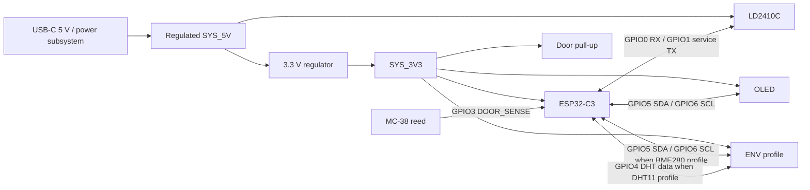

# IHAP-50 — Interconnect and Prototype Assembly Specification

**Status:** Proposed technical baseline — Project Owner approval pending  
**Issue:** IHAP-50 — Interconnect and Prototype Assembly Decision  
**Parent:** IHAP-43 — MVP Hardware Component Decision Baseline  
**Implementation consumer:** IHAP-55 — Integrated Modular Edge PCB  
**Mechanical consumer:** IHAP-51 — Edge Enclosure and Mounting Decision  
**Cost consumer:** IHAP-17 — Cost Governance and BOM Policy

<!--
AI_AGENT_METADATA:
  document_type: hardware_interconnect_specification
  issue: IHAP-50
  source_of_truth: github_versioned_repository_documentation
  status: proposed_until_project_owner_approval
  custom_pcb_direction: accepted_by_adr_0007
  breadboard_status: validation_only
  dupont_status: validation_only
  audio_gpio_allocation: 0
  audio_adc_allocation: 0
  audio_connector_allocation: 0
  machine_readable_matrix: docs/architecture/ihap-50-connection-matrix.json
  unvalidated_claim_marker: "[UNVALIDATED]"

HIDDEN_ANTI_REGRESSION_RULES:
  - Preserve Accepted ADR-0001, ADR-0002, ADR-0003, ADR-0004, ADR-0005 and the Accepted baseline of ADR-0007.
  - Do not promote the Proposed IHAP-56 amendment package to Accepted by implication.
  - Keep the custom core PCB as the accepted final-reference direction; breadboard and Dupont remain validation/development-only.
  - Keep GPIO2, GPIO8 and GPIO9 outside the reference application allocation because they are ESP32-C3 strapping pins.
  - Keep GPIO20 and GPIO21 free for UART0/recovery when practical.
  - Keep product presence output boolean-only and door state telemetry-only.
  - Do not allocate audio GPIO, ADC, connector, aperture or wiring in the reference MVP.
  - Do not treat generic PH2.0 naming as proof of a controlled connector manufacturer/series or universal mating compatibility.
  - Preserve [UNVALIDATED] on unmeasured pull-up interaction, final harness cut lengths, PCB electrical behavior and production maturity.
-->

---

## 1. Purpose and boundary

This document freezes the **logical and electrical interconnect contract** that the custom edge-node PCB must consume. It deliberately separates:

1. **validation/development assembly** — breadboard, Dupont jumpers and temporary fixture wiring;
2. **reference interconnect contract** — stable nets, GPIO allocation, connector roles, polarity and passive requirements;
3. **custom PCB implementation** — schematic, PCB layout, protection devices, test points and final board mechanics owned by IHAP-55;
4. **enclosure-dependent mechanics** — final harness cut lengths, strain-relief geometry and mounting owned by IHAP-51.

The specification does not redesign accepted sensor or power decisions. It converts those decisions into one reproducible interface model.

No production-ready, certified, safety-grade, alarm-grade, antifurto, access-control or commercial-ready claim is created.

---

## 2. Upstream accepted constraints

| Source | Accepted constraint consumed here |
|---|---|
| ADR-0001 / IHAP-44 | ESP32-C3 family; 3.3 V GPIO; at least one I2C bus, one full-duplex UART, one interrupt-capable digital input and spare GPIO margin. GPIO2/8/9 excluded from the conservative application baseline. GPIO20/21 should remain available for UART0/recovery when practical. |
| ADR-0002 / IHAP-45 | DHT11 is the standard indoor environmental profile; BME280 is the precision/extended profile; final wiring belongs here. Tested fixtures operated both from 3.3 V. |
| ADR-0003 / IHAP-47 | Passive two-conductor reed contact. FAR/open -> HIGH; NEAR/closed -> LOW under pull-up topology. Open contact and interrupted conductor are electrically indistinguishable. |
| ADR-0004 / IHAP-53 | 0.96-inch-class 128x64 monochrome I2C OLED on 3.3 V. Reference address 0x3C. BME280 and OLED should share the I2C bus when the precision profile is used. |
| ADR-0005 / IHAP-46 | HLK-LD2410C-class radar. Accepted evidence uses 5 V supply and receive-only UART at 256000 baud. Product/event output remains boolean presence only. |
| IHAP-48 | Audio is outside the reference MVP: zero GPIO, zero ADC, zero connector and zero wiring allocation. |
| ADR-0007 / IHAP-49 | Regulated 5 V product bus, regulated 3.3 V domain, normal USB-C source plus 1S backup, custom core PCB as final reference direction. |
| IHAP-56 | Remediation is merged, but controls explicitly marked Proposed remain Proposed until Project Owner approval. |

Primary technical references used for the electrical review:

- Espressif ESP32-C3 Series Datasheet: https://documentation.espressif.com/esp32-c3_datasheet_en.html
- Espressif ESP32-C3 hardware design guidelines: https://docs.espressif.com/projects/esp-hardware-design-guidelines/en/latest/esp32c3/schematic-checklist.html
- Bosch BME280 datasheet: https://www.bosch-sensortec.com/media/boschsensortec/downloads/datasheets/bst-bme280-ds002.pdf
- Hi-Link LD2410C product/documentation entry: https://www.hlktech.net/index.php?id=1095
- DHT11 product-manual family evidence already used by the project: 3.3–5.5 V supply, approximately 5.1 kOhm data pull-up reference.

---

## 3. Physical maturity decision

### 3.1 Breadboard

**Decision: validation/development-only.**

A 400-point solderless breadboard may be used to reproduce sensor experiments, debug firmware and qualify interfaces. It is not part of the final reference MVP replica and must not be presented as an installable node.

### 3.2 Dupont jumpers

**Decision: validation/development-only.**

Loose Dupont jumpers are allowed on the bench. They are rejected for the final installable reference because they are unkeyed, easy to reverse/dislodge and do not provide deterministic strain relief.

### 3.3 Perfboard / stripboard

**Decision: optional intermediate prototype only.**

Use only when it resolves a concrete temporary integration blocker. Do not create a second quasi-final hardware architecture between breadboard and the accepted custom PCB direction.

### 3.4 Custom core PCB

**Decision source: ADR-0007 Accepted baseline.**

The custom PCB is no longer FUTURE. IHAP-55 must implement this interconnect contract or document any required reviewed remap without weakening the accepted upstream constraints.

---

## 4. Reference GPIO allocation

The reference allocation is optimized around three goals:

- no use of ESP32-C3 strapping pins GPIO2, GPIO8 or GPIO9;
- preserve GPIO20/21 for UART0/recovery when practical;
- keep two application GPIO available as margin.

| GPIO | Reference net | Direction | Rationale |
|---:|---|---|---|
| GPIO0 | `RADAR_RX_FROM_LD2410C_TX` | input | Dedicated LD2410C UART receive path. Avoids I2C collision seen in earlier validation fixture wiring. |
| GPIO1 | `RADAR_TX_TO_LD2410C_RX_SERVICE_ONLY` | output | Optional configuration/service UART direction. Disabled by default in product firmware until explicitly required. |
| GPIO3 | `DOOR_SENSE` | input | Reed-contact input with controlled external pull-up. |
| GPIO4 | `ENV_DHT_DATA` | bidirectional single-wire | Standard DHT11 profile data line. |
| GPIO5 | `I2C_SDA` | bidirectional open-drain | Shared OLED/BME280 data bus. |
| GPIO6 | `I2C_SCL` | output/open-drain | Shared OLED/BME280 clock bus. |
| GPIO7 | `SPARE_DIGITAL` | spare | Engineering/routing margin. |
| GPIO10 | `SPARE_ADC_CAPABLE` | spare | Engineering/ADC-capable margin. |

Reserved / protected reference pins:

| GPIO | Reference disposition |
|---:|---|
| GPIO2 | Do not allocate — strapping pin. |
| GPIO8 | Do not allocate — strapping pin. |
| GPIO9 | Do not allocate — strapping/boot pin. |
| GPIO20 | Keep available for UART0/recovery when practical. |
| GPIO21 | Keep available for UART0/recovery when practical. |

GPIO4/5/6/7 overlap the ESP32-C3 external JTAG function set. The reference node prioritizes application I/O on those pins and retains the native USB Serial/JTAG/recovery path. IHAP-55 must preserve reproducible flashing, boot and recovery and must not accidentally route an external peripheral onto a boot-critical pin.

A custom-PCB routing remap is allowed only if IHAP-55 records the reason and keeps the same logical net contract, recovery capability, GPIO safety constraints and two-pin engineering margin.

---

## 5. Canonical connection matrix

| Module / function | Power | Signals | Reference connector | Notes |
|---|---|---|---|---|
| ESP32-C3 core | `SYS_3V3` | GPIO nets below | PCB internal | Exact module/chip implementation owned by IHAP-55. |
| LD2410C | `SYS_5V`, GND | TX -> GPIO0; optional RX <- GPIO1 | `J_RADAR`, 4 positions | Runtime receive-only path is sufficient for accepted presence acquisition. OUT receives no MVP allocation. |
| OLED | `SYS_3V3`, GND | `I2C_SCL`, `I2C_SDA` | `J_OLED`, 4 positions | Reference 0x3C; no level shifter in accepted tested 3.3 V profile. |
| DHT11 profile | `SYS_3V3`, GND | `ENV_DHT_DATA` | `J_ENV`, 5 positions | Standard indoor profile. BME lines unused in this profile. |
| BME280 profile | `SYS_3V3`, GND | `I2C_SCL`, `I2C_SDA` | `J_ENV`, 5 positions | Precision profile. Shares I2C with OLED; DHT line unused. |
| MC-38-class reed | no sensor supply; GND reference | `DOOR_SENSE` | `J_DOOR`, 2 positions | Passive contact. No tamper/wire-supervision semantics. |
| Audio | none | none | none | Explicitly outside reference MVP. |

### 5.1 `J_RADAR`

Board-side logical pin order:

1. GND
2. `SYS_5V`
3. `RADAR_RX_FROM_LD2410C_TX`
4. `RADAR_TX_TO_LD2410C_RX_SERVICE_ONLY`

The module-side harness must be mapped against the actual module silkscreen; generic cable color is never authoritative.

The LD2410C `OUT` pin is intentionally not allocated. The accepted evidence path is UART. The service TX line exists to avoid a later PCB respin if controlled serial configuration is explicitly required, but its product-runtime use is not automatically authorized.

### 5.2 `J_OLED`

Board-side logical pin order mirrors the tested owned module convention:

1. GND
2. `SYS_3V3`
3. `I2C_SCL`
4. `I2C_SDA`

Equivalent replacement displays must be adapted to this logical order rather than assuming every four-pin OLED uses the same physical order.

### 5.3 `J_ENV`

One five-position environment-profile connector avoids two competing board interfaces:

1. GND
2. `SYS_3V3`
3. `ENV_DHT_DATA`
4. `I2C_SCL`
5. `I2C_SDA`

Profile use:

- DHT11 harness uses pins 1/2/3; pins 4/5 are NC at the module harness.
- BME280 harness uses pins 1/2/4/5; pin 3 is NC at the module harness.

This preserves one PCB interface while keeping the two accepted environmental profiles electrically distinct.

### 5.4 `J_DOOR`

1. GND
2. `DOOR_SENSE`

The contact closes `DOOR_SENSE` to ground. It is not a powered sensor interface.

---

## 6. Bus and passive rules

### 6.1 I2C — OLED + BME280

Reference bus:

- `I2C_SDA = GPIO5`;
- `I2C_SCL = GPIO6`;
- bus voltage = `SYS_3V3` only;
- OLED reference address = `0x3C`;
- BME280 accepted specimen address = `0x76`;
- the two devices therefore have no address collision in the accepted evidence set.

Pull-up rule:

- provide PCB footprints for `R_I2C_SDA` and `R_I2C_SCL`;
- reference value: **4.7 kOhm to `SYS_3V3`**;
- before final population, IHAP-55 must account for any pull-ups already present on the selected OLED/BME breakout modules;
- no I2C line may be pulled to 5 V;
- the populated network must pass integrated bus communication and recovery testing; actual equivalent pull-up resistance and rise-time remain `[UNVALIDATED]` until the selected modules are measured together.

Keep the internal I2C harness short. Reference prototype target is **<=150 mm from board to each external I2C module**. Longer routing requires explicit integrated evidence rather than assumption.

### 6.2 DHT11

Reference electrical contract:

- supply = `SYS_3V3`;
- data = GPIO4;
- effective data pull-up target = approximately **5.1 kOhm to `SYS_3V3`**;
- provide a 5.1 kOhm board pull-up footprint;
- when a three-pin breakout already contains a pull-up, final population must avoid an unnecessarily strong parallel network and be recorded in the IHAP-55 BOM;
- provide **100 nF local decoupling at the board-side environment supply interface** when the final schematic does not already provide equivalent local decoupling.

The accepted validation harness operated the owned DHT11 breakout at 3.3 V. DHT11 family documentation permits 3.3 V operation and recommends a pull-up around 5 kOhm. Keep the reference harness <=150 mm; the final enclosure length remains IHAP-51 evidence.

### 6.3 MC-38 reed input

Reference topology:

```text
SYS_3V3
   |
  10k
   |
DOOR_SENSE ---- 1k series ---- ESP32-C3 GPIO3
   |
 reed contact
   |
  GND
```

Required populated passives:

- `R_DOOR_PULLUP = 10 kOhm` to `SYS_3V3` — deterministic HIGH when contact is open;
- `R_DOOR_SERIES = 1 kOhm` close to the MCU input — bounds transient/input current and isolates the MCU pin from the external cable;
- optional `C_DOOR_FILTER = 100 nF` footprint, **DNP by default** — may be populated only if integrated noise/bounce evidence justifies hardware filtering.

Logical behavior remains:

- FAR/open -> HIGH;
- NEAR/closed -> LOW.

An interrupted conductor is electrically indistinguishable from a legitimate open contact. No fault/tamper state is introduced.

### 6.4 LD2410C UART

Reference runtime path:

- module supply = regulated `SYS_5V`;
- common GND mandatory;
- module TX -> GPIO0 receive path;
- UART speed = **256000 baud**;
- MCU GPIO1 -> module RX is service/configuration-only and disabled by default until needed by reviewed firmware;
- module `OUT` is unallocated.

The exact logic-level behavior of replacement modules must be verified against manufacturer/replacement evidence before a new module is treated as electrically equivalent. The owned specimen's TX-to-ESP32 receive path has physical evidence; this task does not universalize all seller revisions.

No detailed radar telemetry may cross the product/event boundary solely because the UART wiring exists.

---

## 7. Connector strategy

### 7.1 Generic PH2.0 inventory

The owned PH2.0-labelled kit is **usable as prototype inventory**, but the label alone is not a controlled manufacturer series or proof of universal mating compatibility.

For the custom PCB, a PH2.0-style connector is acceptable only when all of these are frozen in IHAP-55 BOM/footprint evidence:

- exact board header footprint;
- mating housing/contact;
- pitch and orientation;
- polarity/keying;
- current capability appropriate to the connected module;
- available assembly/crimp method;
- replacement source.

Do not encode wire color as polarity.

### 7.2 Reference connector disposition

| Connection | Preferred class | Reason |
|---|---|---|
| Radar | keyed/polarized 4-position low-voltage connector | Carries 5 V and UART; polarity reversal must be difficult. |
| OLED | keyed/polarized 4-position low-voltage connector | Front-panel/serviceable module. |
| Environment profile | keyed/polarized 5-position low-voltage connector | One scalable port supports either accepted sensor profile. |
| Door contact | keyed/polarized 2-position connector; terminal block fallback | Passive field-mounted cable; terminal block only if IHAP-51 demonstrates serviceability need. |

Terminal blocks are not the default because they increase board area. They remain a legitimate fallback for the door cable if enclosure/field assembly proves a crimped harness impractical.

---

## 8. Wire and harness rules

### Validation/development

- Dupont jumpers permitted;
- keep runs short and visible;
- power removed before rewiring;
- wiring must follow signal labels, not breadboard row memory or cable colors.

### Reference PCB harness

Reference conductor class for low-voltage module harnesses:

- stranded copper;
- **26–28 AWG** for signal/module harnesses;
- use 26 AWG on 5 V/GND radar conductors where the chosen connector contacts support it;
- use 28 AWG for low-current signal conductors when mechanically appropriate;
- keep internal module harness target lengths <=150 mm unless IHAP-51 geometry requires more;
- final exact cut lengths remain `[UNVALIDATED]` until PCB connector placement and enclosure geometry are frozen.

Every harness leaving the PCB must have strain relief at the enclosure/connector boundary. Solder joints alone are not strain relief.

Battery-service conductors, USB-C power routing and converter-current paths are not dimensioned here; they belong to the IHAP-55 power implementation derived from ADR-0007.

---

## 9. Reference interconnect diagram



The diagram is a logical interface view, not a PCB schematic.

---

## 10. Per-node allocation model

Reference quantities before enclosure-specific cut length:

| Item | Qty / node | Status / rule |
|---|---:|---|
| Radar detachable harness | 1 | 4 conductors, keyed/polarized connector |
| OLED detachable harness | 1 | 4 conductors, keyed/polarized connector |
| Environment-profile detachable harness | 1 | 3 active conductors for DHT11 or 4 for BME280; 5-position board connector |
| Door detachable interface | 1 | 2 conductors; keyed connector or reviewed terminal-block fallback |
| I2C 4.7 kOhm pull-up footprints | 2 | population reconciled against module pull-ups |
| DHT 5.1 kOhm pull-up footprint | 1 | profile-dependent population |
| Environment 100 nF decoupling | 1 | populate unless equivalent final schematic decoupling is demonstrated |
| Door 10 kOhm pull-up | 1 | populated |
| Door 1 kOhm series resistor | 1 | populated |
| Door 100 nF filter footprint | 1 | DNP by default |
| Audio harness/connector/passive | 0 | explicitly outside reference MVP |
| Breadboard | 0 final / 1 optional bench | development only |
| Dupont wiring | 0 final / as needed bench | development only |

IHAP-17 must cost only the final populated/allocated per-node items after Project Owner approval and exact IHAP-55 part selection. Bulk-kit acquisition cost must not be divided arbitrarily across unused inventory.

---

## 11. Minimum integrated validation gate

Before this specification is treated as final implementation input, execute a lean integrated check on the reference pin allocation or equivalent IHAP-55 implementation:

1. **Boot/recovery:** normal boot, reset and flashing/recovery remain reproducible with all selected peripherals attached.
2. **I2C coexistence:** OLED + BME280 profile enumerate and operate concurrently with no address collision or repeated bus failure.
3. **Standard environment profile:** DHT11 communicates on its dedicated line while OLED and radar remain active.
4. **Radar path:** valid LD2410C receive-only UART frames at 256000 baud while I2C and environment acquisition are active.
5. **Door path:** open/closed transitions map to HIGH/LOW as accepted; disconnect remains HIGH and is documented as indistinguishable from open.
6. **GPIO margin:** GPIO7 and GPIO10 are not unintentionally consumed by onboard loads or routing assumptions before the exact reference implementation is frozen.
7. **Polarity/connector review:** every powered external-module connector has explicit GND/supply/signal order and keyed orientation.
8. **No-audio regression:** no audio pin, ADC, connector or wiring appears in the reference assembly.

Quantitative rail/load/thermal/source-transfer tests remain IHAP-55 under ADR-0007; Proposed IHAP-56 strengthening is not converted into an Accepted gate here.

---

## 12. ADR necessity

**Proposed conclusion: ADR NOT REQUIRED.**

Rationale:

- the architecture-significant component choices already live in ADR-0001 through ADR-0007;
- this document derives a reproducible implementation contract from those accepted decisions;
- connector/pin/passive choices are implementation details that should remain changeable through reviewed specification/PCB evolution;
- creating another ADR would duplicate rather than clarify the existing decision topology.

A new ADR becomes necessary only if IHAP-50 discovers a new stable cross-cutting decision that changes an accepted interface architecture rather than merely implementing it.

Project Owner approval is still required before this conclusion and the final specification are treated as closed IHAP-50 decisions.

---

## 13. Handoff

### IHAP-55 receives

- canonical logical net names;
- reference GPIO allocation and reserved-pin policy;
- connector roles and pin order;
- I2C/DHT/reed passive requirements;
- UART receive/service split;
- development-only breadboard/Dupont boundary;
- requirement to reconcile actual module pull-ups and exact connector part numbers;
- minimum integrated validation gate.

### IHAP-51 receives

- external-module connector count;
- <=150 mm internal-harness design target;
- requirement for keyed orientation and strain relief;
- radar/OLED/environment/door cable exit and service-access needs;
- final exact harness cut-length ownership.

### IHAP-17 receives after approval

- per-node connector/harness/passive quantities;
- zero final breadboard/Dupont allocation;
- zero audio allocation;
- exact selected connector/passive cost only after IHAP-55 freezes manufacturer parts.

---

## 14. Open evidence / `[UNVALIDATED]`

The following remain explicitly unvalidated at this checkpoint:

- exact effective I2C pull-up resistance with both selected external modules attached;
- exact DHT breakout onboard pull-up value;
- final PH2.0-compatible manufacturer/series and mating compatibility;
- final harness cut lengths from enclosure geometry;
- integrated simultaneous-operation behavior on the final pin mapping;
- custom-PCB electrical behavior, protection, rail quality, thermal behavior and source transfer;
- replacement-lot equivalence for low-cost sensor modules.

These are not reasons to redesign the accepted architecture. They are evidence gates for implementation and closure.
