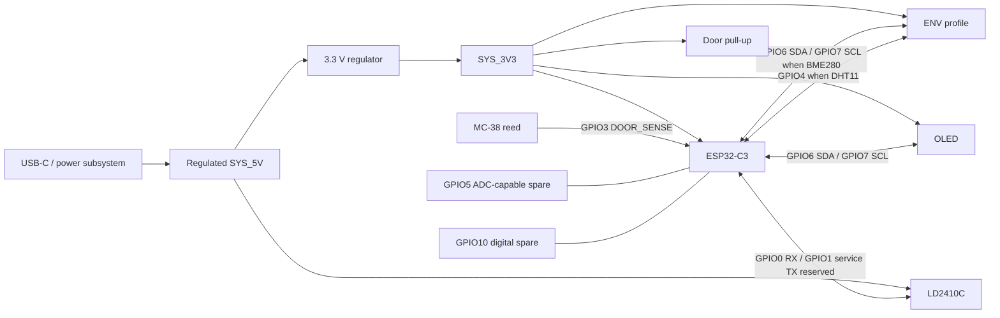

# IHAP-50 — Interconnect and Prototype Assembly Specification

**Status:** **ACCEPTED — Project Owner approval 2026-09-11**  
**Issue:** IHAP-50 — Interconnect and Prototype Assembly Decision  
**Parent:** IHAP-43 — MVP Hardware Component Decision Baseline  
**Implementation consumer:** IHAP-55 — Integrated Modular Edge PCB  
**Mechanical consumer:** IHAP-51 — Edge Enclosure and Mounting Decision  
**Cost consumer:** IHAP-17 — Cost Governance and BOM Policy  
**Merge gate:** PR #36 must receive Codex review before merge

<!--
AI_AGENT_METADATA:
  document_type: hardware_interconnect_specification
  issue: IHAP-50
  source_of_truth: github_versioned_repository_documentation
  status: accepted_by_project_owner
  accepted_at: 2026-09-11
  merge_gate: codex_review_required_before_merge
  custom_pcb_direction: accepted_by_adr_0007
  breadboard_status: validation_only
  dupont_status: validation_only
  audio_gpio_allocation: 0
  audio_adc_allocation: 0
  audio_connector_allocation: 0
  machine_readable_matrix: docs/architecture/ihap-50-connection-matrix.json
  gpio_mapping_revision: 2
  accepted_standard_evidence: docs/evidence/IHAP-50/IHAP50-STANDARD-11-summary.json
  accepted_precision_evidence: docs/evidence/IHAP-50/IHAP50-PRECISION-01-summary.json
  unvalidated_claim_marker: "[UNVALIDATED]"

HIDDEN_ANTI_REGRESSION_RULES:
  - Preserve the Accepted IHAP-50 logical/reference interconnect contract below.
  - Preserve Accepted ADR-0001, ADR-0002, ADR-0003, ADR-0004, ADR-0005 and the Accepted baseline of ADR-0007.
  - Do not promote the Proposed IHAP-56 amendment package to Accepted by implication; IHAP-50 approval does not approve it.
  - Keep the custom core PCB as the accepted final-reference direction; breadboard and Dupont remain validation/development-only.
  - Keep GPIO2, GPIO8 and GPIO9 outside the reference application allocation because they are ESP32-C3 strapping pins.
  - Keep GPIO20 and GPIO21 free for UART0/recovery when practical.
  - Preserve one real ADC-capable spare GPIO as required by ADR-0001.
  - Keep GPIO1 radar service TX disabled by default; the accepted validation path is receive-only.
  - Keep product presence output boolean-only and door state telemetry-only.
  - Do not allocate audio GPIO, ADC, connector, aperture or wiring in the reference MVP.
  - Do not treat generic PH2.0 naming as proof of a controlled connector manufacturer/series or universal mating compatibility.
  - Preserve [UNVALIDATED] on final connector SKU/footprint, final pull-up population, final harness cut lengths, custom-PCB electrical/power behavior and production maturity.
-->

---

## 1. Purpose and acceptance boundary

This document freezes the **Accepted logical and electrical interconnect contract** that the custom edge-node PCB must consume. Project Owner approval was granted on 2026-09-11 after both required physical profiles passed and the final regression review found no unresolved IHAP-50 blocker.

It separates four maturity layers:

1. **validation/development assembly** — breadboard, Dupont jumpers and temporary fixture wiring;
2. **Accepted reference interconnect contract** — stable nets, GPIO allocation, connector roles, polarity and passive requirements;
3. **custom PCB implementation** — schematic, layout, protection devices, test points, exact component population and final board implementation owned by IHAP-55;
4. **enclosure-dependent mechanics** — final harness cut lengths, strain-relief geometry and mounting owned by IHAP-51.

Acceptance of this specification does not reopen accepted sensor or power decisions and does not promote downstream implementation evidence into completion. It converts the accepted upstream decisions into one reproducible interface model.

No production-ready, certified, safety-grade, alarm-grade, antifurto, access-control or commercial-ready claim is created.

---

## 2. Upstream accepted constraints

| Source | Accepted constraint consumed here |
|---|---|
| ADR-0001 / IHAP-44 | ESP32-C3 family; 3.3 V GPIO; one I2C bus; one full-duplex UART; one interrupt-capable digital input; one spare ADC-capable GPIO; at least eight safe application GPIO. GPIO2/8/9 excluded from the conservative application baseline. GPIO20/21 should remain available for UART0/recovery when practical. |
| ADR-0002 / IHAP-45 | DHT11 standard indoor profile; BME280 precision/extended profile; both accepted validation paths used 3.3 V; final wiring belongs to IHAP-50. |
| ADR-0003 / IHAP-47 | Passive two-conductor reed contact. FAR/open -> HIGH; NEAR/closed -> LOW under pull-up topology. Open contact and interrupted conductor are electrically indistinguishable. |
| ADR-0004 / IHAP-53 | 0.96-inch-class 128x64 monochrome I2C OLED on 3.3 V. Reference address 0x3C. BME280 and OLED share one I2C bus in the precision profile. |
| ADR-0005 / IHAP-46 | HLK-LD2410C-class radar. Accepted evidence uses 5 V supply and receive-only UART at 256000 baud. Product/event output remains boolean presence only. |
| IHAP-48 | Audio is outside the reference MVP: zero GPIO, zero ADC, zero connector and zero wiring allocation. |
| ADR-0007 / IHAP-49 | Regulated 5 V product bus, regulated 3.3 V domain, USB-C normal source plus 1S backup, custom core PCB as final reference direction. |
| IHAP-56 / PR #35 | Remediation merged. Controls explicitly remaining **Proposed** in IHAP-56 remain Proposed; IHAP-50 acceptance does not promote them. |

Primary references for the electrical mapping are the Espressif ESP32-C3 datasheet/hardware guidelines plus manufacturer documentation already linked by the accepted sensor ADRs.

---

## 3. Accepted physical maturity decision

### 3.1 Breadboard

**Validation/development-only.** A solderless breadboard may reproduce sensor tests and debug interfaces, but it is not part of the final reference node and must not be presented as installable hardware.

### 3.2 Dupont jumpers

**Validation/development-only.** Loose Dupont jumpers are acceptable on the bench but rejected for the final installable reference because they are unkeyed, easy to reverse/dislodge and provide no deterministic strain relief.

### 3.3 Perfboard / stripboard

**Optional intermediate prototype only.** Use only if it removes a concrete temporary integration blocker. Do not create a second quasi-final architecture between breadboard and the accepted custom PCB direction.

### 3.4 Custom core PCB

**Accepted direction from ADR-0007.** The custom PCB is no longer FUTURE. IHAP-55 must implement this Accepted IHAP-50 contract or document a reviewed remap without weakening its invariants.

---

## 4. Accepted reference GPIO allocation — revision 2

The mapping is frozen around these invariants:

- do not allocate strapping pins GPIO2, GPIO8 or GPIO9;
- keep GPIO20/21 available for UART0/recovery when practical;
- keep two application GPIO as engineering margin;
- ensure that one spare is **actually ADC-capable**;
- keep the LD2410C runtime validation path receive-only and service TX disabled by default.

Espressif maps ADC capability on ESP32-C3 to GPIO0–GPIO5. The first IHAP-50 draft incorrectly labelled GPIO10 as ADC-capable. Static review classified that as **MAJOR** and remediated it before accepted physical evidence was acquired.

### 4.1 Canonical allocation

| GPIO | Reference net | Direction | Accepted rationale |
|---:|---|---|---|
| GPIO0 | `RADAR_RX_FROM_LD2410C_TX` | input | Dedicated LD2410C receive path at 256000 baud. |
| GPIO1 | `RADAR_TX_TO_LD2410C_RX_SERVICE_ONLY` | output/service reservation | Optional controlled service/configuration direction; disabled by default and undriven by the validation harness. |
| GPIO3 | `DOOR_SENSE` | input | Reed-contact input with controlled external pull-up. |
| GPIO4 | `ENV_DHT_DATA` | bidirectional single-wire | Standard DHT11 profile data line. |
| GPIO5 | `SPARE_ADC_CAPABLE` | spare | Real ADC-capable engineering margin; ESP32-C3 ADC2_CH0. |
| GPIO6 | `I2C_SDA` | bidirectional open-drain | Shared OLED/BME280 data bus. |
| GPIO7 | `I2C_SCL` | bidirectional open-drain | Shared OLED/BME280 clock bus. |
| GPIO10 | `SPARE_DIGITAL` | spare | Digital/routing engineering margin. |

### 4.2 Reserved / protected pins

| GPIO | Reference disposition |
|---:|---|
| GPIO2 | Do not allocate — strapping pin. |
| GPIO8 | Do not allocate — strapping pin. |
| GPIO9 | Do not allocate — strapping/boot pin. |
| GPIO20 | Keep available for UART0/recovery when practical. |
| GPIO21 | Keep available for UART0/recovery when practical. |

GPIO4/5/6/7 overlap external JTAG functions. The reference node prioritizes application I/O there and retains the native USB Serial/JTAG and boot/recovery path. IHAP-55 must still prove reproducible flashing, reset and recovery on the final PCB implementation.

The ESP32-C3 GPIO matrix allows I2C signals to be routed to GPIO6/GPIO7; therefore moving I2C away from the historical GPIO5/GPIO6 validation fixture does not change the accepted I2C architecture.

A PCB routing remap is allowed only if IHAP-55 records the reason and preserves the logical net contract, safe boot behavior, recovery capability, one ADC-capable spare and a second engineering-margin GPIO.

---

## 5. Canonical connection matrix

| Module / function | Power | Signals | Reference connector | Notes |
|---|---|---|---|---|
| ESP32-C3 core | `SYS_3V3` | GPIO nets below | PCB internal | Exact module/chip implementation owned by IHAP-55. |
| LD2410C | `SYS_5V`, GND | TX -> GPIO0; optional service RX <- GPIO1 | `J_RADAR`, 4 positions | Runtime receive-only path is sufficient for accepted presence acquisition. `OUT` has no MVP allocation. |
| OLED | `SYS_3V3`, GND | GPIO7 SCL, GPIO6 SDA | `J_OLED`, 4 positions | Reference address 0x3C. |
| DHT11 profile | `SYS_3V3`, GND | GPIO4 data | `J_ENV`, 5 positions | Standard indoor profile. |
| BME280 profile | `SYS_3V3`, GND | GPIO7 SCL, GPIO6 SDA | `J_ENV`, 5 positions | Precision profile; shares I2C with OLED. |
| MC-38-class reed | no sensor supply; GND reference | GPIO3 `DOOR_SENSE` | `J_DOOR`, 2 positions | Passive contact; no tamper/wire-supervision semantics. |
| Audio | none | none | none | Explicitly outside reference MVP. |

### 5.1 `J_RADAR`

Board-side logical order:

1. GND
2. `SYS_5V`
3. `RADAR_RX_FROM_LD2410C_TX`
4. `RADAR_TX_TO_LD2410C_RX_SERVICE_ONLY`

The module-side harness must map against actual module pin labels; cable color is never authoritative. LD2410C `OUT` is intentionally not allocated. Existence of the service TX line does not authorize new product semantics or persistent detailed radar telemetry.

### 5.2 `J_OLED`

Board-side logical order:

1. GND
2. `SYS_3V3`
3. `I2C_SCL`
4. `I2C_SDA`

Equivalent displays must adapt to this logical order; appearance alone does not prove identical pin order.

### 5.3 `J_ENV`

One five-position board interface supports either accepted environmental profile:

1. GND
2. `SYS_3V3`
3. `ENV_DHT_DATA`
4. `I2C_SCL`
5. `I2C_SDA`

Profile use:

- DHT11: pins 1/2/3; 4/5 NC at module harness;
- BME280: pins 1/2/4/5; 3 NC at module harness.

This keeps one scalable PCB interface without pretending the two sensor protocols are interchangeable.

### 5.4 `J_DOOR`

1. GND
2. `DOOR_SENSE`

The contact closes `DOOR_SENSE` to ground. It is not a powered sensor interface.

---

## 6. Accepted bus and passive rules

### 6.1 I2C — OLED + BME280

Accepted reference bus:

- SDA = GPIO6;
- SCL = GPIO7;
- bus voltage = `SYS_3V3` only;
- OLED accepted reference address = `0x3C`;
- BME280 accepted specimen address = `0x76`;
- no address collision exists in accepted physical evidence.

Accepted PCB requirements:

- footprints for `R_I2C_SDA` and `R_I2C_SCL`;
- **4.7 kOhm to `SYS_3V3` is the accepted candidate value for those footprints**;
- final population must account for pull-ups already present on selected OLED/BME280 modules;
- no I2C line may be pulled to 5 V.

The final equivalent pull-up resistance/rise-time calculation and exact populated values remain `[UNVALIDATED]` IHAP-55 work. PRECISION-01 does establish that the tested OLED+BME280 prototype path operates concurrently on GPIO6/GPIO7.

Reference internal harness target: <=150 mm from board to each I2C module. Longer routing requires explicit integrated evidence. Final exact cut lengths belong to IHAP-51.

### 6.2 DHT11

Accepted reference contract:

- supply = `SYS_3V3`;
- data = GPIO4;
- provide a board pull-up footprint targeting an effective value around **5.1 kOhm to `SYS_3V3`**;
- if the selected three-pin breakout already contains a pull-up, final population must avoid an unnecessarily strong parallel network;
- provide local 100 nF decoupling at the environment interface unless the final schematic demonstrates an equivalent local decoupling path.

The owned DHT11 path passed STANDARD-11 at 3.3 V. Exact onboard pull-up value on the selected breakout and exact final board population remain `[UNVALIDATED]` until measured/identified by IHAP-55.

### 6.3 MC-38 reed input

**Accepted IHAP-50 reference topology:**

```text
SYS_3V3
   |
  10k
   |
DOOR_SENSE ---- 1k series ---- ESP32-C3 GPIO3
   |
 reed contact
   |
  GND
```

Accepted passives/rules:

- `R_DOOR_PULLUP = 10 kOhm` to `SYS_3V3`;
- `R_DOOR_SERIES = 1 kOhm` close to the MCU input;
- `C_DOOR_FILTER = 100 nF` footprint, **DNP by default**; population later requires evidence of a concrete noise/bounce need.

STANDARD-11 physically demonstrated FAR/open -> HIGH (`1,1`), NEAR/closed -> LOW (`0,0`), and one interrupted conductor -> HIGH (`1,1`). An interrupted conductor therefore remains indistinguishable from a legitimate open contact. No fault/tamper state is introduced.

### 6.4 LD2410C UART

Accepted runtime/reference path:

- supply = regulated `SYS_5V`;
- common ground mandatory;
- module TX -> GPIO0;
- baud = 256000;
- GPIO1 -> module RX only as service/configuration reservation, disabled by default;
- module `OUT` unallocated.

STANDARD-11 and PRECISION-01 demonstrated fresh valid receive frames with zero parsed invalid frames on the tested specimen. Replacement electrical equivalence remains `[UNVALIDATED]` until a replacement profile is reviewed.

---

## 7. Accepted connector strategy

The owned `PH2.0`-labelled kit remains acceptable **prototype inventory**, but the generic label is not a controlled manufacturer series and does not prove universal mating compatibility.

The Accepted final-reference rule is to use keyed/polarized low-voltage detachable interfaces. For a PH2.0-style family to become the final PCB implementation, IHAP-55 must freeze:

- exact board header/footprint;
- mating housing/contact;
- pitch and orientation;
- polarity/keying;
- current capability for the connected module;
- crimp/assembly method;
- replacement source.

Accepted interface classes:

| Connection | Accepted class | Rationale |
|---|---|---|
| Radar | keyed/polarized 4-position low-voltage connector | Carries 5 V + UART. |
| OLED | keyed/polarized 4-position low-voltage connector | Front-panel/serviceable module. |
| Environment | keyed/polarized 5-position low-voltage connector | One port supports either accepted environmental profile. |
| Door | keyed/polarized 2-position connector; terminal-block fallback only if IHAP-51 demonstrates a serviceability need | Passive field-mounted cable. |

Wire color must never encode the only polarity information.

---

## 8. Accepted wire and harness rules

### Validation/development

- Dupont permitted only on the bench;
- keep runs short and visible;
- remove power before rewiring;
- follow net/pin labels rather than breadboard row memory or cable colors.

### Reference PCB harness

Accepted design range/rules:

- stranded copper;
- 26–28 AWG for short module harnesses, subject to the selected connector contact specification;
- prefer 26 AWG for radar 5 V/GND where the chosen contact supports it;
- exact conductor gauge must remain compatible with connector crimp range and measured load;
- internal module harness target <=150 mm unless IHAP-51 geometry requires more;
- final exact cut lengths remain `[UNVALIDATED]` until PCB connector placement and enclosure geometry are frozen.

Every harness leaving the PCB must receive mechanical strain relief. Solder joints alone are not strain relief.

Battery-service conductors, USB-C input routing and high-current converter paths remain IHAP-55 / ADR-0007 implementation scope.

---

## 9. Logical interconnect diagram



This is a logical interface view, not a PCB schematic.

---

## 10. Accepted per-node allocation model

| Item | Qty / node | Accepted rule |
|---|---:|---|
| Radar detachable interface | 1 | 4 positions |
| OLED detachable interface | 1 | 4 positions |
| Environment-profile interface | 1 | 5 positions |
| Door detachable interface | 1 | 2 positions |
| I2C pull-up footprints | 2 | required footprints; exact population after module-network reconciliation |
| DHT pull-up footprint | 1 | required footprint; profile-dependent final population |
| Environment 100 nF decoupling | 1 | unless equivalent local decoupling is demonstrated |
| Door 10 kOhm pull-up | 1 | populated reference baseline |
| Door 1 kOhm series resistor | 1 | populated reference baseline |
| Door 100 nF filter footprint | 1 | DNP by default |
| Audio interface/passives | 0 | outside reference MVP |
| Breadboard | 0 final; optional bench | development only |
| Dupont wiring | 0 final; as needed bench | development only |

IHAP-17 receives these Accepted logical quantities but must cost exact selected/populated parts only after IHAP-55 freezes manufacturer parts and final population. Bulk-kit acquisition cost must not be divided arbitrarily over unused stock.

---

## 11. Accepted integrated validation evidence

IHAP-50 closure evidence is complete for its own scope.

### 11.1 `IHAP50-STANDARD-11` — PASS

Accepted evidence demonstrates:

- normal boot/reset through the corrected ESP32-C3 USB Serial/JTAG validation path;
- exact canonical pin map;
- GPIO5 ADC-spare and GPIO10 digital-spare pull tests PASS;
- BME280 absent as required by STANDARD;
- OLED stable with operator visual gate confirmed;
- DHT11 valid on GPIO4;
- LD2410C fresh on GPIO0 at 256000 baud with valid frames and zero parsed invalid frames;
- MC-38 OPEN/FAR `1,1`, CLOSED/NEAR `0,0`, disconnected conductor `1,1`;
- OLED and radar remained alive during all MC-38 phases;
- connector polarity/pin-order operator review confirmed.

### 11.2 `IHAP50-PRECISION-01` — PASS

Accepted evidence demonstrates:

- exact canonical pin map and spare checks remain valid;
- DHT11 absent as intended;
- BME280 detected at `0x76`, identity `0x60`, reliable across all six accepted baseline samples;
- OLED remains operational concurrently on shared GPIO6/GPIO7 I2C;
- LD2410C remains fresh with valid frames and zero parsed invalid frames;
- GPIO1 service TX remains disabled.

### 11.3 Gate interpretation

These runs physically validate the **tested prototype interconnect behavior** for both accepted environmental profiles. They do not validate final PCB rail quality, final pull-up population, source transfer, battery charging, thermal behavior, enclosure routing, certification or production maturity.

Quantitative power/thermal/battery/source-transfer tests remain IHAP-55 under ADR-0007. Controls explicitly remaining Proposed under IHAP-56 remain Proposed and are not converted into Accepted gates here.

---

## 12. Review findings and remediation history

### SR-50-01 — incorrect ADC capability — REMEDIATED

- **Severity:** MAJOR before remediation.
- **Initial defect:** GPIO10 was labelled `SPARE_ADC_CAPABLE`.
- **Correction:** GPIO5 is the ADC-capable spare (`ADC2_CH0`); shared I2C moved to GPIO6/GPIO7; GPIO10 remains `SPARE_DIGITAL`.
- **Regression guard:** machine-readable and human mappings agree; physical spare checks PASS.

### SR-50-02 — service TX configured by validation harness — REMEDIATED

- **Severity:** MAJOR before remediation.
- **Initial defect:** the harness attached GPIO1 as UART TX despite the accepted receive-only baseline.
- **Correction:** UART1 validation path is RX-only on GPIO0; GPIO1 is not attached to the UART peripheral.
- **Regression guard:** boot evidence emits `radar_tx_service_configured=false`; evaluator rejects enabled service TX.

### SR-50-03 — ESP32 target / USB console regression — REMEDIATED

- **Initial defect:** an early build generated `esptool --chip esp32`; ROM bootloader correctly identified the physical device as ESP32-C3. USB Serial/JTAG console was also not explicitly pinned.
- **Correction:** `firmware/sdkconfig.defaults` pins ESP32-C3 and USB Serial/JTAG. The established 3.5 s re-enumeration guard is retained as validation tooling.
- **Evidence:** board ROM/download path recovered and subsequent physical gates completed successfully.

### SR-50-04 — stale serial samples crossed operator boundaries — REMEDIATED

- **Initial defect:** samples queued while the operator changed a physical state could be attributed to the following state.
- **Correction:** the runner aborts profile mismatches, clears serial input at every confirmed acquisition boundary, and displays sequence-tagged fresh samples.
- **Evidence:** accepted STANDARD-11 phases use separated monotonic samples: OPEN seq 8/9, CLOSED 14/15, DISCONNECTED 17/18.

No threshold or accepted sensor semantic was weakened to obtain PASS.

---

## 13. Accepted ADR disposition

**ACCEPTED: ADR NOT REQUIRED.**

The architecture-significant component decisions already live in ADR-0001 through ADR-0007. IHAP-50 derives a reproducible implementation/interconnect contract from those accepted decisions. GPIO, connector and passive allocation remain reviewable implementation details that IHAP-55 may remap only with explicit compatibility evidence while preserving the Accepted IHAP-50 invariants.

A new ADR becomes necessary only if a future change introduces a stable cross-cutting architecture decision rather than merely implementing this contract.

---

## 14. Downstream handoff

### IHAP-55 receives

- Accepted canonical logical net names;
- Accepted reference GPIO allocation;
- reserved/boot/recovery policy;
- required preservation of a real ADC-capable spare;
- connector roles and logical pin order;
- Accepted I2C/DHT/reed passive **footprint and reference-value requirements**;
- UART receive/service split with service TX disabled by default;
- development-only breadboard/Dupont boundary;
- final effective pull-up reconciliation and exact connector-part freeze requirements;
- final PCB flashing/recovery, protection, power/rail and thermal validation ownership.

### IHAP-51 receives

- four external-module interface roles;
- keyed-orientation and strain-relief requirement;
- <=150 mm internal-harness design target unless geometry proves otherwise;
- final exact harness cut-length ownership;
- radar/OLED/environment/door service-access needs.

### IHAP-17 receives

- Accepted logical per-node connector/harness/passive quantities;
- zero final breadboard/Dupont allocation;
- zero audio allocation;
- exact selected connector/passive prices only after IHAP-55 freezes manufacturer parts and final population.

---

## 15. Remaining `[UNVALIDATED]` after IHAP-50 acceptance

The following are intentionally **not** converted to Accepted implementation evidence by PO approval of IHAP-50:

- exact effective I2C pull-up resistance/rise time and final PCB pull-up population;
- DHT breakout onboard pull-up value and final PCB pull-up population;
- exact connector manufacturer/series/SKU/mating compatibility/footprints;
- final harness cut lengths and enclosure routing;
- final custom-PCB flashing/recovery behavior on its chosen MCU implementation;
- custom-PCB electrical protection, rail quality, thermal behavior and source transfer;
- replacement-lot equivalence for low-cost sensor modules;
- production reliability, certification and commercial readiness.

These are downstream implementation evidence gates, not reasons to reopen the Accepted IHAP-50 contract.

---

## 16. Merge gate

Project Owner acceptance is complete. PR #36 must remain unmerged until **Codex review** has been received and all material findings are resolved on the same IHAP-50 branch/PR. If a Codex remediation changes any Accepted contract item above, the impact must be surfaced before merge rather than silently changing the accepted baseline.
