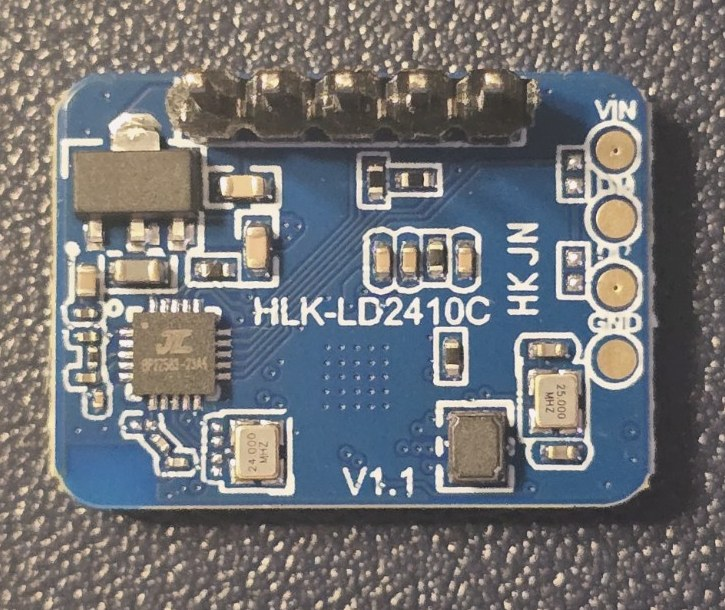
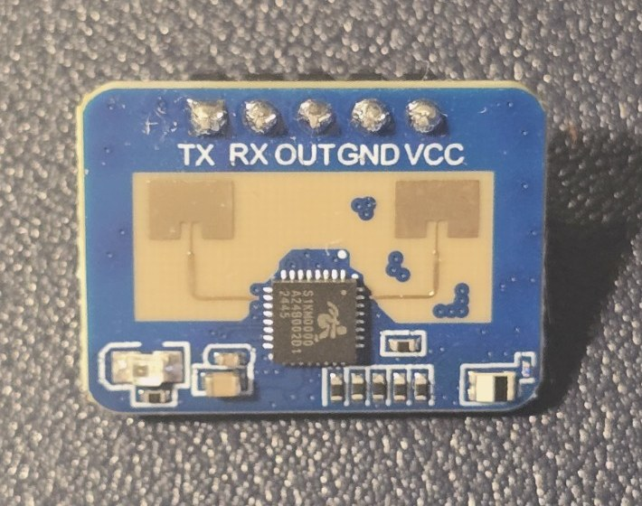

# IHAP-46 — HLK-LD2410C V1.1 Physical Evidence

**Issue:** [IHAP-46](https://niccolopiazzi01.atlassian.net/browse/IHAP-46)  
**Evidence owner:** Project Owner  
**Received:** 2026-07-15  
**Repository purpose:** durable, human-readable physical evidence for one owned presence-sensor specimen

<!--
AI_AGENT_METADATA:
  document_type: hardware_evidence_manifest
  issue: IHAP-46
  evidence_scope: one_owned_hlk_ld2410c_v1_1_specimen
  source: project_owner_supplied_photographs
  original_files_committed: false
  published_files_sanitized: true
  upload_status: pending_project_owner_binary_commit
  transformations:
    - crop
    - jpeg_reencode
    - jpeg_compression
    - exif_removal
  privacy_review: passed_for_repository_publication
  unvalidated_claim_marker: "[UNVALIDATED]"

HIDDEN_ANTI_REGRESSION_RULES:
  - These photographs prove visible observations about one owned specimen only.
  - Do not infer seller identity, lot consistency, complete schematic, signal voltage, output logic level, or universal LD2410C equivalence.
  - Do not use the photographs as proof of UART operation, detection performance, power stability, production readiness, or MVP suitability.
-->

## Evidence files

The normalized JPEG files are prepared for the Project Owner's manual binary commit.

| Evidence ID | File | View | Dimensions | Size | SHA-256 |
|---|---|---|---:|---:|---|
| E-IHAP46-01 | [`ld2410c-v1-1-component-side.jpg`](ld2410c-v1-1-component-side.jpg) | Component/controller side | 725 × 610 | 132,160 bytes | `6be1da4612c8e771b173c7a05cf2a856b2455e670fad4fccfb259a486924a180` |
| E-IHAP46-02 | [`ld2410c-v1-1-antenna-side.jpg`](ld2410c-v1-1-antenna-side.jpg) | Antenna and pin-label side | 710 × 560 | 97,703 bytes | `12153b876680b6cdcdd98f93f8296add50f797f4d273954b79d3b4b56c325059` |

## Published images

### E-IHAP46-01 — Component/controller side

Visible observations:

- `HLK-LD2410C` silkscreen;
- `V1.1` PCB revision silkscreen;
- five-pin header;
- populated controller and support components;
- additional unpopulated circular pads on the PCB edge.

### E-IHAP46-02 — Antenna and pin-label side

Visible observations:

- antenna structures;
- five soldered header positions;
- pin labels, left to right in the photographed orientation: `TX`, `RX`, `OUT`, `GND`, `VCC`;
- populated radio/controller package and support components.

## Provenance and transformations

The Project Owner supplied both photographs in the project conversation.

The source uploads used a `.heic` filename but contained JPEG image payloads. Repository copies were produced without generative alteration.

Applied transformations:

1. cropped unused surrounding background;
2. decoded and re-encoded the raster as JPEG;
3. removed EXIF metadata, including device or location metadata;
4. applied repository-friendly JPEG compression;
5. retained the original visible component content without reconstruction.

No component, label, trace, pin, solder joint, antenna, package, or marking was added, removed, reconstructed, or enhanced.

The original uploads are not committed. The checksums above refer to the complete normalized JPEG files prepared for repository upload.

## Claims supported

The images support claims about the visible layout and labels of one owned specimen:

- the board is visibly marked `HLK-LD2410C`;
- the board is visibly marked `V1.1`;
- the photographed specimen exposes five labelled connections;
- the visible pin order on the antenna side is `TX RX OUT GND VCC`;
- an antenna side and a component/controller side are physically present;
- the specimen can be uniquely referenced in IHAP-46 test metadata as `LD2410C-HLK-V1.1-OWNED-01`.

## Claims not supported

The images do not prove:

- exact seller, commercial SKU, listing, date code, or lot;
- electrical equivalence with other LD2410C boards;
- signal voltage or ESP32-C3 GPIO compatibility;
- UART baud rate, frame format, or successful communication;
- OUT pin logic level or timing;
- regulator behavior, current draw, rail stability, or autonomy;
- detection range, angle, stationary-presence performance, latency, or false-positive behavior;
- resistance to wall, corridor, door, curtain, fan, pet, or environmental interference;
- configuration persistence after reset;
- production, commercial, reliability, safety, security, alarm, or certification maturity.

Those claims remain `[UNVALIDATED]` unless supported by separate physical test evidence.
